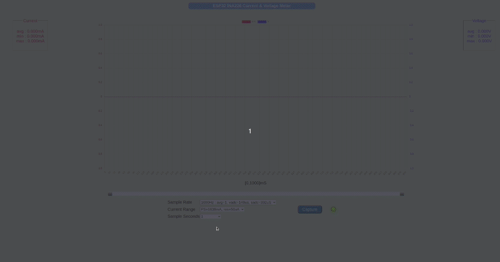

# ESP32_INA226_CURRENT_VOLTAGE_METER

ESP32 development board with INA226 sensor used to capture and record load bus voltage
and load current of a Device Under Test (DUT). 

Meter configuration, capture and display functions are available via a web page running on a WiFi web server. 

## Features

Full-scale bus voltage = ~40V. 

Two ranges for current measurement : 
* HIGH : Full-scale 1638mA, with a resolution of 50uA.
* LOW : Full-scale 78mA, with a resolution of 2.4uA.

Three sample rate options :
* 1000Hz : 1mS sample period, no sample averaging, vbus ADC conversion time = 140uS, shunt ADC conversion time = 332uS.
* 500Hz : 2mS sample period, no sample averaging, vbus ADC conversion time 140uS, shunt ADC conversion time = 1100uS.
* 200Hz : 5mS sample period, averaging 4 samples, vbus ADC conversion time 140uS, shunt ADC conversion time = 332uS.

Up to 16000 samples can be captured with a single trigger. 
* Sample Rate = 1000Hz : Maximum 16 second capture.
* Sample Rate = 500Hz : Maximum 32 second capture.
* Sample Rate = 200Hz : Maximum 80 second capture.

Gated capture up to the maximum of 16000 samples is available. The external gate signal is input via an opto-isolator. 
This gate signal can come from the Device Under Test (DUT) or other external trigger.

The system initially boots up as a stand-alone WiFi Access Point and web server with SSID `ESP32_INA226`, no password required.

Connect to this WiFi AP, then open the home page `http://192.168.4.1` in a browser. 
If your OS has mDNS support, use the url `http://meter.local`.
MacOS has built-in support for mDNS. For Windows, install Bonjour. For Ubuntu, install Avahi.

Full meter functionality is available in this stand-alone mode. 

It may be more convenient for the meter to connect as a station to an existing WiFi Access Point so you do not have to switch between access points just to use the meter.

On the home page you can specify an external WiFi Access Point SSID and password. 
Submit the WiFi credentials and restart the ESP32.
Now it will connect as a station to the configured Access Point and then start the web server. 
The web page is at `http://meter.local` as before. 

If you do not have OS mDNS support, and you still want to use the meter in station mode, 
you will need a serial debug connection to the ESP32. Check the serial monitor log on reboot to get the station IP address assigned to the meter by the external WiFi Access Point. 

## Device Under Test Example

The power supply is an 18650 Li-Ion battery. The DUT is an ESP32 development board. 

On reset, the DUT ESP32 executes the following cyclical sequence :
1. Connects to a WiFi Internet Access Point as a station
2. Connects to a Network Time Protocol (NTP) server to get local time
3. Enters deep sleep for 10 seconds
4. Restarts

The DUT ESP32 uses a gpio pin to set the current meter gate high on restart, and resets the gate just before going to sleep. The DUT ESP32 is active for approximately 2.5 seconds and in deep-sleep for 10 seconds.

This is an example of an 8-second capture @ 1000Hz, HIGH scale. The capture was manually triggered approximately half-way during the DUT ESP32 deep-sleep interval.

The deep-sleep mode current is ~10mA  due to the USB-UART interface and LDO regulator on the DUT ESP32 development board. 

In active mode, we can see high current pulses  (> 400mA),  corresponding to WiFi radio transmission bursts.

This is an example of gated capture. It records the load current & voltage only while the DUT ESP32 is active.

## Choosing Sample Rates

Sampling at 200Hz will result in less noise due to sample averaging. It also allows you to capture longer intervals.

However, it may not capture brief current pulses or record accurate maximum/minimum values.

In the first gated capture display, a sample rate of 200Hz was selected for capture.

In the second gated capture display, a sample rate of 1000Hz was selected for capture.

The voltage measurement is noisier, but it captures all of the current pulses due to WiFi transmission bursts.

Maximum and minimum current values are more accurately captured.

# Build Environment
* Ubuntu 20.04 LTS amdx64
* Visual Studio Code with PlatformIO plugin using Arduino framework targeting `esp32dev` board. 
* The file `platformio.ini` specifies the framework packages, ESP32 configuration, and external libraries.
* External libraries used :
	* EspAsyncWebServer
	* AsyncTCP
	* ArduinoJson

# Hardware 

[Circuit Schematic](docs/esp32_ina226_schematic.pdf)

* Any ESP32 development board with on-board USB-UART.
* INA226 current sensor.
* A pi-filter network + low-noise MIC5205 LDO voltage regulator provides the power supply for the INA226.
* IRF7831 N-chan mosfet (Rds = 4 milli-Ohms),  used to switch shunt resistors for current measurements.
* PC817 opto-coupler for gated measurement.
* 0.05ohm 1% shunt resistor for HIGH current scale.
* 1.0 ohm 1% shunt resistor for LOW current scale.
* SS56 schottky diode, protects the 1.0 ohm shunt resistor when the LOW current scale is selected.

# Credits
* [Range switching with FET switches](https://www.youtube.com/watch?v=xSEYPP5Xsi0)
* [Javascript scrolling chart](https://stackoverflow.com/questions/35854244/how-can-i-create-a-horizontal-scrolling-chart-js-line-chart-with-a-locked-y-axis)

