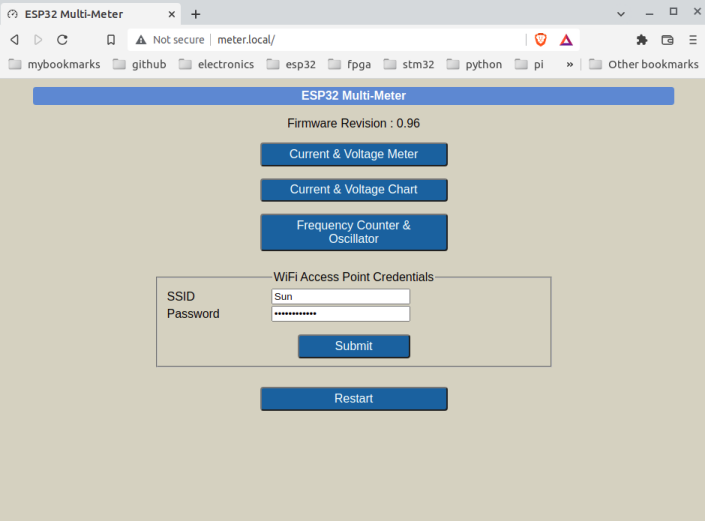
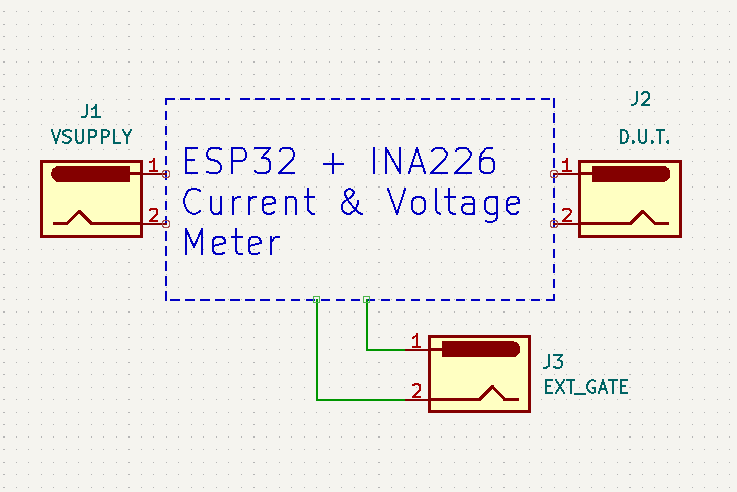
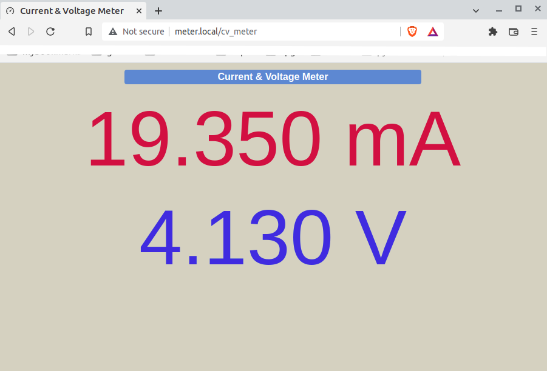
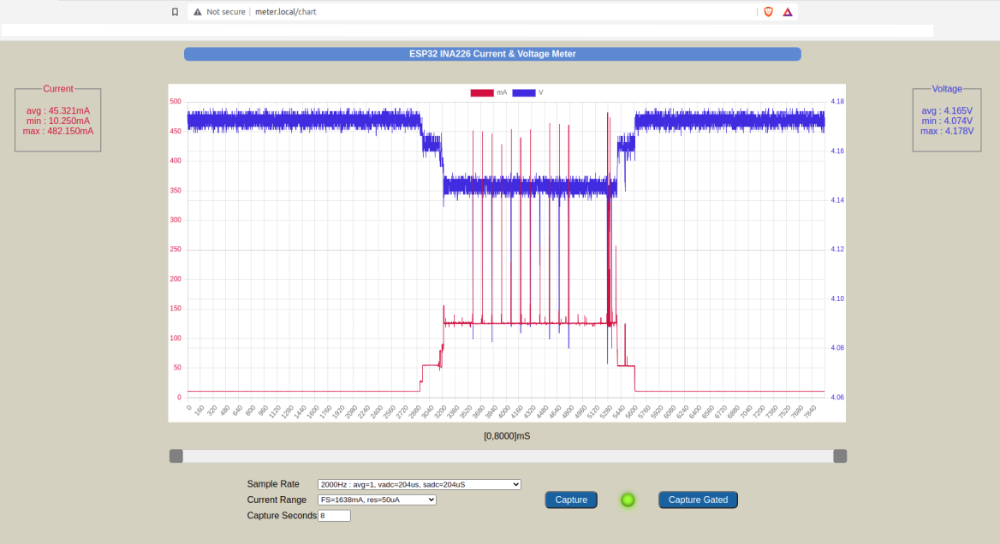
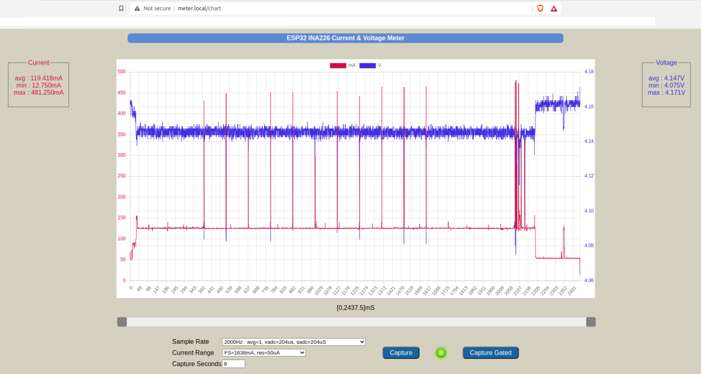
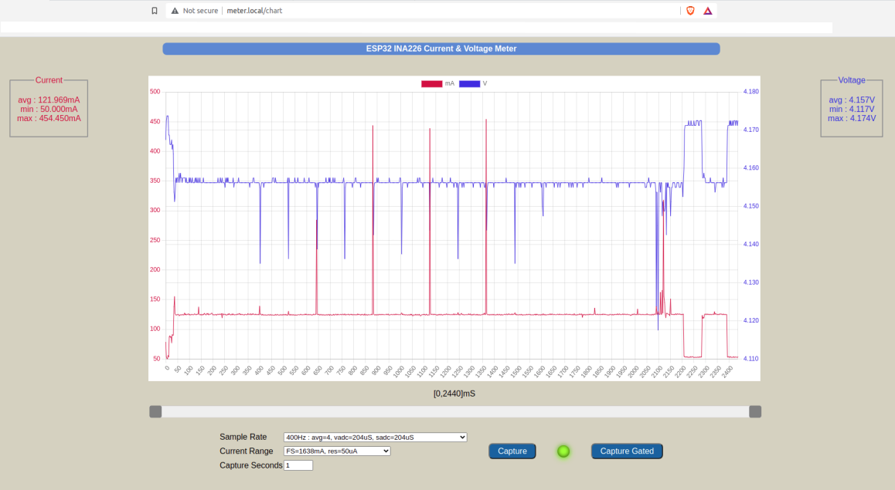
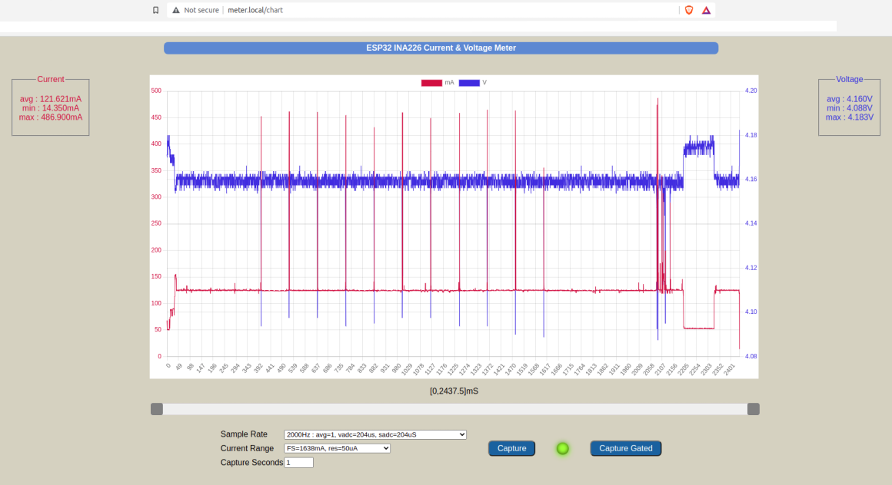
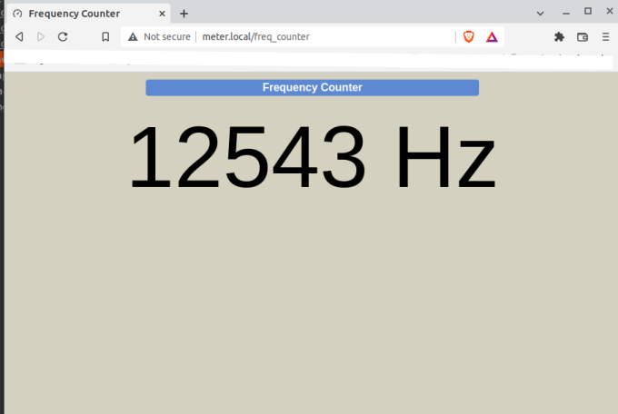

# ESP32 MULTI-METER

ESP32 development board used to implement WiFi multi-meter with following functions :

* Capture and display load bus voltage and load current, in meter mode or chart recorder mode. Uses INA226 sensor.
* [Frequency counter with range 1Hz to 40MHz and 1Hz resolution, and independent oscillator (signal generator)].](https://blog.eletrogate.com/esp32-frequencimetro-de-precisao)

## Circuit Schematic

[PDF Schematic](docs/esp32_meter_schematic.pdf)

## Configuration

If not configured, the meter boots up as a stand-alone WiFi Access Point (SSID `ESP32_METER`, no password required) and web server.

Connect to this WiFi Access Point, then open the home page `http://192.168.4.1` in a browser. 
If your OS has mDNS support, use the url `http://meter.local`.

MacOS has built-in support for mDNS. On Windows, install Bonjour. On Ubuntu, install Avahi.

Full meter functionality is available in this stand-alone mode. 

However, it is more convenient for the meter to connect as a station to an existing WiFi Access Point.

On the home page you can specify an external WiFi Access Point SSID and password. 
Submit the WiFi credentials and restart the ESP32.
Now it will connect as a station to the configured Access Point and then start the web server. 
The web page is at `http://meter.local` as before. 

If you do not have OS mDNS support, and you still want to use the meter in station mode, you will need a serial debug connection to the ESP32. 
Check the serial monitor log on reboot to get the station IP address assigned to the meter by the external WiFi Access Point. 

# Current & Voltage Display

Full-scale bus voltage = ~40V. 

There are two ranges for current measurement : 
* HIGH : Full-scale 1638mA, with a resolution of 50uA.
* LOW : Full-scale 78mA, with a resolution of 2.4uA.

Meter configuration, capture and display functions are available via a web page. 

There are two display modes :
* Meter display with current and voltage readings updated every second
* Scrollable chart display with manually triggered or gated capture

## Current & Voltage Meter

DUT current and voltage are updated every second.

In this mode, the meter uses a fixed sampling configuration : 
* vbus ADC conversion time 1.1mS
* shunt ADC conversion time 1.1mS
* averages 128 samples for every meter reading 

The current range is automatically switched. 

If the load current < 78mA, the low range (0 - 78mA) is used  with 2.4uA resolution.

If the load current >= 78mA, the high range (0 - 1638mA) is used  with 50uA resolution.

## Current & Voltage Chart

There are two capture options : manually triggered with a selected capture interval, and gated capture.

Sample rate options :
* 2000Hz : no sample averaging, vbus ADC conversion time 204uS, shunt ADC conversion time 204uS.
* 1000Hz : no sample averaging, vbus ADC conversion time 332uS, shunt ADC conversion time 332uS.
* 400Hz : averaging 4 samples, vbus ADC conversion time 140uS, shunt ADC conversion time 140uS.

Current range options :
* 0 - 78mA with 2.4uA resolution
* 0 - 1638mA with 50uA resolution

In Chart Display mode, we need to manually select the current range. Auto-ranging is not possible due to the high sampling rate.

Click on the legends `ma` and `V` above the plot to toggle the display of the corresponding data.

Use the scroll bar sliders to display a subset of the captured data.

## Manually triggered capture with selected time interval

Up to 16000 samples can be captured with a single trigger. So the maximum capture interval depends on the selected sampling rate.

* max 8 seconds capture @ 2000Hz
* max 16 seconds capture @ 1000Hz
* max 40 seconds capture @ 400Hz

## Gated Capture 

The external gate signal is input via an opto-isolator. 
This gate signal can come from the Device Under Test (DUT) or other external trigger. 

Once triggered, capture will start when the gate input goes high.

Capture will end when the gate input goes low, or 16000 samples have been captured.

## Example D.U.T.

The DUT is an ESP32 development board running an Internet connectivity test. 

The power supply is a fully-charged 18650 Li-Ion battery. 

On reset, the DUT ESP32 executes the following sequence :
1. Connects to a WiFi Internet Access Point as a station
2. Connects to a Network Time Protocol (NTP) server to get local time
3. Enters deep sleep for 5 seconds
4. Restarts

The DUT ESP32 is periodically active for approximately 2.4 seconds, and in deep-sleep for 5 seconds.

The DUT ESP32 uses a GPIO pin to set the meter gate signal high on restart, and resets the gate signal just before going to sleep. 

## Manually triggered capture

This is an example of an 8-second manually triggered capture. The capture was triggered approximately half-way during the DUT ESP32 deep-sleep interval.

We can see that the DUT load current is ~10mA when the ESP32 is in deep-sleep. This residual current is due to the USB-UART IC and LDO regulator on the DUT ESP32 development board. 

When the DUT ESP32 is active, we can see high current pulses (> 450mA) corresponding to WiFi radio transmission bursts.

## Gated capture

This is an example of gated capture. It records the load current & voltage only while the DUT ESP32 is active.

# Choosing Sample Rates

## Example : Sample Rate = 400Hz
Sampling at 400Hz will result in less noise due to sample averaging. It also allows you to capture longer intervals.

However, it may not capture brief current pulses or record accurate maximum/minimum values.

## Example : Sample Rate = 2000Hz

The measurements are noisier, but it captures all the current pulses due to WiFi transmission bursts.

Maximum and minimum current values are more accurately captured.

# Frequency Counter & Oscillator

* 3.3V TTL level counter input on gpio 34
* Counter has 1Hz to 40MHz range with 1Hz resolution
* Independent clock signal generator output on gpio pin 33
* Connect generator signal output to frequency counter input for counter verification. In the snapshot above, the generator output has been set to 13429Hz and connected to the counter input pin.

# Build Environment
* Ubuntu 20.04 LTS amdx64
* Visual Studio Code with PlatformIO plugin using Arduino framework targeting `esp32dev` board. 
* The file `platformio.ini` specifies the framework packages, ESP32 configuration, and external libraries.
* External libraries used :
	* EspAsyncWebServer
	* AsyncTCP
	* ArduinoJson
* Chart.js v3.7.0

# Hardware 

* Any ESP32 development board with on-board USB-UART.
* INA226 current sensor.
* A pi-filter network + low-noise MIC5205 LDO voltage regulator provides the power supply for the INA226.
* IRF7831 N-chan mosfets (Rds = 4 milli-Ohms),  used to switch shunt resistors for current measurements.
* PC817 opto-coupler for gated measurement.
* 0.05ohm 1% shunt resistor for HIGH current scale.
* 1.0 ohm 1% shunt resistor for LOW current scale.
* SS56 schottky diode, protects the 1.0 ohm shunt resistor when the LOW current scale is selected.
* Frequency input signal (3.3V TTL level) on gpio 34.
* Oscillator output signal on gpio 33. 

# Credits
* [Range switching with FET switches](https://www.youtube.com/watch?v=xSEYPP5Xsi0)
* [Javascript scrolling chart](https://stackoverflow.com/questions/35854244/how-can-i-create-a-horizontal-scrolling-chart-js-line-chart-with-a-locked-y-axis)
* [Frequency Counter & Oscillator](https://blog.eletrogate.com/esp32-frequencimetro-de-precisao)

