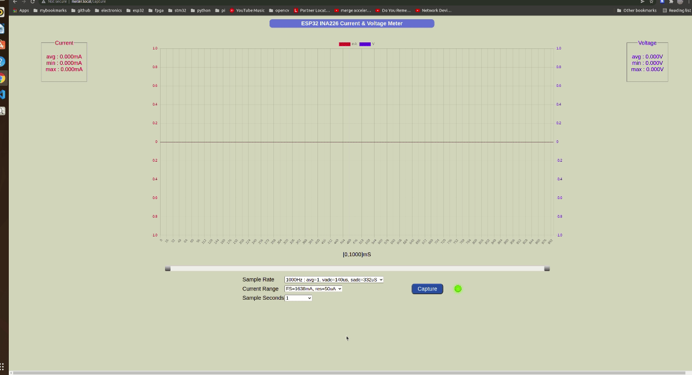
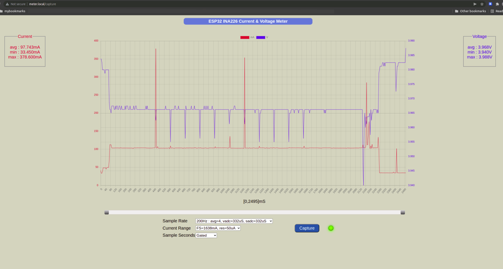
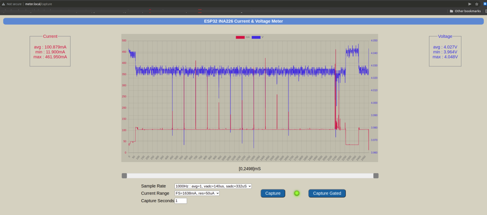

# ESP32_INA226_METER

An ESP32 module together with an INA226 current sensor is used to monitor bus voltage
and load current. A web server provides capture and display features via a web page.

The bus voltage can be up to 40V. 

There are two ranges for current measurement : 
* HIGH : full-scale 1638mA, with a resolution of 50uA
* LOW : full-scale 78mA, with a resolution of 2.4uA

There are 3 sample rate options :
* 1000Hz : 1mS sample period, no sample averaging, vbus ADC conversion time = 140uS, shunt ADC conversion time = 332uS
* 500Hz : 2mS sample period, no sample averaging, vbus ADC conversion time 140uS, shunt ADC conversion time = 1100uS
* 200Hz : 5mS sample period, averaging 4 samples, vbus ADC conversion time 140uS, shunt ADC conversion time = 332uS

A maximum of 16000 samples can be captured with a single capture trigger. 
* Sample Rate = 1000Hz : Maximum 16 second capture
* Sample Rate = 500Hz : Maximum 32 second capture
* Sample Rate = 200Hz : Maximum 80 second capture

Gated capture up to the maximum of 16000 samples is available. The gate signal is provided via an opto-isolator. This can come from the Device Under Test (DUT) or some other external automated trigger.

If an external WiFi Access Point has not been configured or is unavailable, the system boots up
as a stand-alone WiFi Access Point and web server with SSID `ESP32_INA226`, no password required.

Connect to this WiFi AP, then open the page `http://192.168.4.1` in a browser. 

If your OS has mDNS support, use the url `http://meter.local`.
MacOS has built-in support for mDNS. For Windows, install Bonjour. For Ubuntu, install Avahi.

On the home page you can configure an external WiFi AP SSID and password. Submit the WiFi credentials and restart the ESP32, now it will connect as a station to the configured AP SSID. You can then now access the url `http://meter.local` as before. 

If you do not have mDNS support, you will have to check the serial monitor log to get the dynamically assigned IP address for the meter. Or access the meter as a stand-alone AP and web server with fixed webpage at `http://192.168.4.1`.

# Build Environment
* Ubuntu 20.04 LTS amdx64
* Visual Studio Code with PlatformIO plugin using Arduino framework targeting `esp32dev` board. 
* The file `platformio.ini` specifies the framework packages, ESP32 configuration, and libraries used by the project.
* External libraries used :
	* EspAsyncWebServer
	* AsyncTCP
	* ArduinoJson

# Hardware 

[Circuit Schematic](docs/esp32_ina226_schematic.pdf)

* Any ESP32 Development board with on-board USB-UART chip and LDO regulator.
* INA226 current sensor
* IRF7831 N-chan mosfet x 2 : used for switching shunt resistors for scale change.
* PC817 opto-coupler for gated current measurement
* 0.05ohm 1% shunt resistor
* 1.0 ohm 1% shunt resistor
* SS56 schottky diode, acts as protection for the 1ohm shunt resistor when the low current scale is selected.

# Usage

	
Sampling at 200Hz will result in less noise, but may not capture pulse current events and peak values (maxima/minima).

For example, here are a couple of gated capture recorded at 200Hz and 1000Hz. 

The power supply is an 18650 Li-Ion battery. The DUT is an ESP32 module connecting to an Internet Access Point as a station, then connecting to a Network Time Protocol (NTP) server to get local time, then going to sleep for 10 seconds before restarting. 

The DUT sets the gate pin high on start, and resets the gate pin low just before going to sleep.

In the first capture snapshot, a sample rate of 200Hz was selected.

In the second capture snapshot, a sample rate of 1000Hz was selected. It's noisier, but captures the narrow current pulses and corresponding voltage dips due to WiFi transmission bursts. The maximum and minimum current values are more accurately captured.

# Credits
* [Range switching with FET switches](https://www.youtube.com/watch?v=xSEYPP5Xsi0)

